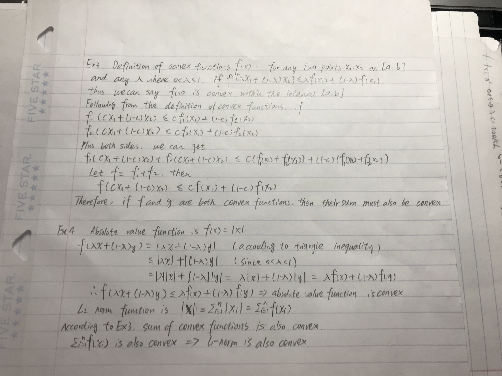

<!--
%\VignetteEngine{knitr::rmarkdown}
%\VignetteIndexEntry{The linear model vignette}
-->

## Problem 1 (P117.Q7)
```{r}
set.seed(1217)

# first write the Epanechnikov kernel function 
kernel <- function(x) {
ind <- as.numeric(abs(x) <= 1)
k<- (3/4) * ( 1 - x^2 ) * ind
return(k)
}

# then write the Epanechnikov density function 
kern_density <- function(x, h, x_new){
  density_est <- numeric()
  for (i in 1:length(x_new)){
    density_est[i] <- mean(kernel((x-x_new[i])/h))/h
  }
  density_est
}

#visualize different bandwidths

# when training set and test set are random numbers from normal distribution
x <- rnorm(1000, 0, 10)
x_new <- sort(rnorm(200, 0, 10))
par(mfrow=c(3,2))
h = c(0.01,0.1, 0.5, 1, 1.5, 2)
for (i in h){
  plot(x_new, kern_density(x,i,x_new), ylab = "Density", main = "Kernal density estimation", type = "l")  
  legend("topright",
       legend=c(
paste("bandwidth= ", i)),cex=0.5)
}

# when training set and test set are random numbers from uniform distribution
x <- runif(1000, 0, 5)
x_new <- sort(runif(200, 0, 5))
par(mfrow=c(3,2))
h = c(0.01,0.1, 0.5, 1, 1.5, 2)
for (i in h)
  {
  plot(x_new, kern_density(x,i,x_new), ylab = "Density", main = "Kernal density estimation", type = "l")  
  legend("bottom",
       legend=c(
paste("bandwidth= ", i)),cex=0.5)
}
```

 From the plots above, we can find that no matter what datasets are, when bandwidth increases, the kernal density estimations become smooth and close to normal distribtion. And when bandwidth increases to a certain value, the Kernal density estimation remains similar no matter how bandwidth increases.




## Problem 5 (P200.Q6)

```{r}
library(Matrix)
library(glmnet)
# Check current KKT conditions for glmnet when 0 < alpha <= 1
## Args:
# X: A numeric data matrix.
# y: Response vector.
# b: Current value of the regression vector.
# lambda: The penalty term.
## Returns:
# A logical vector indicating where the KKT conditions have
# been violated by the variables that are currently zero.
# KKT check function
check_kkt <- function(y, X, b, lambda) {
  resids <- y - X %*% b 
  s <- apply(X, 2, function(xj) crossprod(xj, resids)) / lambda / nrow(X)
  (b == 0) & (abs(s) >= 1)
}
# use iris as dataset
x <- scale(model.matrix(Sepal.Length ~. -1, iris))
y <- iris[,1]
# implement lasso 
lasso_reg_with_screening <- function(x, y){
  m1 <- cv.glmnet(x,y,alpha=1)
  #use 1se as the criteria to choose lambda
  lambda <- m1$lambda.1se
  b <- m1$glmnet.fit$beta[, m1$lambda == lambda]
  check_kkt(y, x, b, lambda)
}
lasso_reg_with_screening(x, y)
```

 Based on the KKT conditions for lasso regression, the lasso_reg_with_screening was created. The returned list of this function checks whether the KKT conditions are violated ('False' means no violation)

 I used the iris dataset for testing when the lambda used was $lambda.1se$. None of the coefficient estimations from glmnet broke the KKT conditions.  